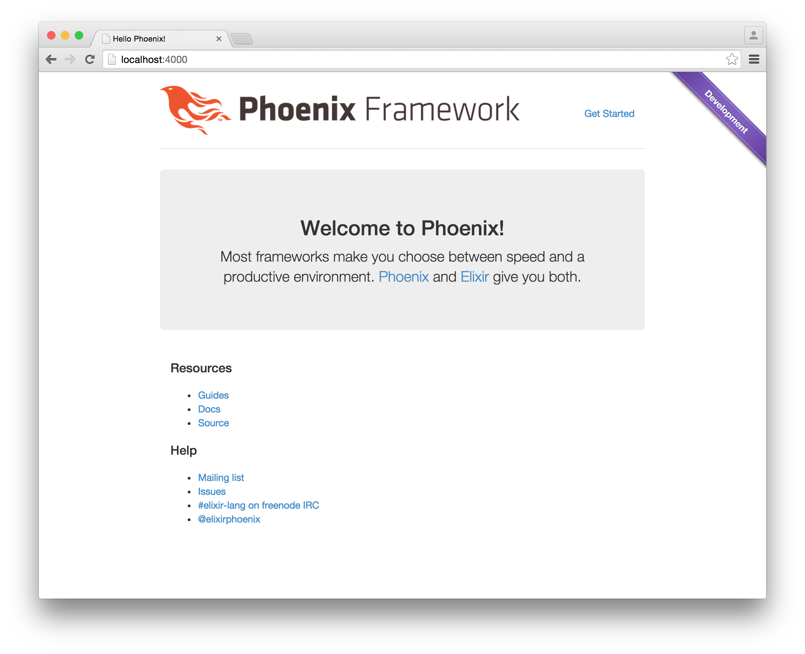

# plug_ribbon

[](https://travis-ci.org/stnly/plug_ribbon)
[](https://hex.pm/packages/plug_ribbon)
[](LICENSE)

This [Plug](https://github.com/elixir-lang/plug) module injects a ribbon to your web application in the development environment.

Used to differentiate development environment from production.



## Motivation

Inspired by [rack-dev-mark](https://github.com/dtaniwaki/rack-dev-mark)

## Setup

To use plug_ribbon in your projects, edit your `mix.exs` file and add plug_ribbon as a dependency:

```elixir
defp deps do
  [
    {:plug_ribbon, ">= 0.1.0"}
  ]
end
```

## Usage

This plug should be one of the last ones in your pipeline.

```elixir
defmodule MyPhoenixApp.Router do
  use MyPhoenixApp.Web, :router

  pipeline :browser do
    plug :accepts, ["html"]
    plug :fetch_session
    plug :fetch_flash
    plug :protect_from_forgery
    plug Plug.Ribbon
  end

  pipeline :api do
    plug :accepts, ["json"]
  end

  scope "/", MyPhoenixApp do
    pipe_through :browser # Use the default browser stack

    get "/", PageController, :index
  end

  # Other scopes may use custom stacks.
  # scope "/api", Observes do
  #   pipe_through :api
  # end
end
```

After you are done, run `mix deps.get` in your shell to fetch the dependencies.

## Testing

Since this module uses environment variables, run the tests with it set to `dev`.

```bash
$ MIX_ENV=dev mix test
```

## License

See the [LICENSE](LICENSE) file for more information.

